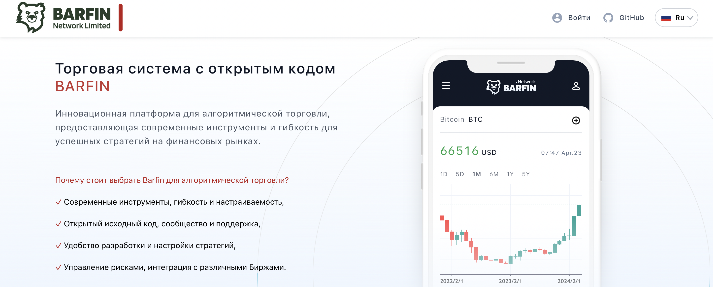

# Демо проект по автоматизации Barfin Network

## Содержание

- [Технологический стек](#технологический-стек)
- [Покрытый функционал](#покрытый-функционал)
- [Сборка в Jenkins](#сборка-в-jenkins)
- [Запуск из терминала](#запуск-из-терминала)
- [Примеры использования](#примеры-использования)
- [Allure отчет](#allure-отчет)
- [Интеграция с Jira](#интеграция-с-jira)
- [Отчет в Telegram](#отчет-в-telegram)
- [Видео примеры прохождения тестов](#видео-примеры-прохождения-тестов)

## Технологический стек(#технологический-стек)

➠ Технологический стек

  
  
  
   
  
  
  
  
  
  
  
  
   

